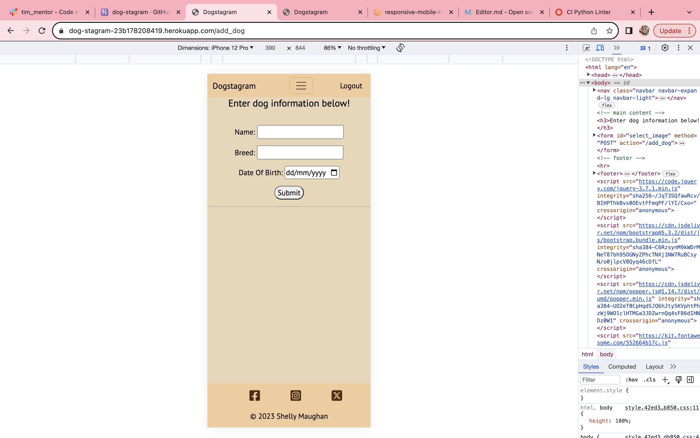
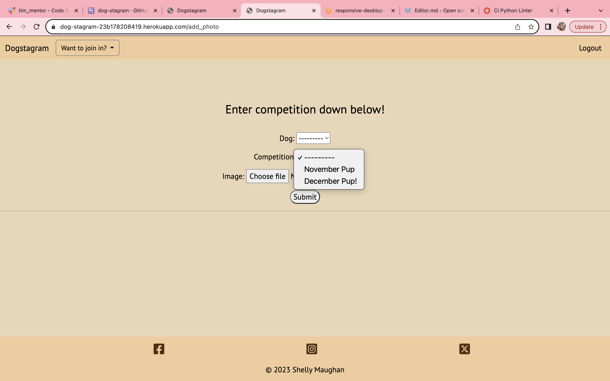
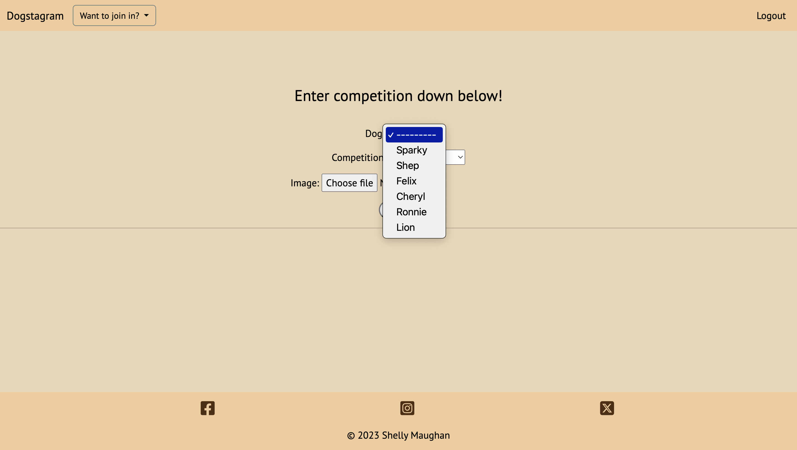

# Testing

## Code Validation

### HTML

I have used the recommended [HTML W3C Validator](https://validator.w3.org) to validate all of my HTML files.

| Page | W3C URL | Screenshot | Notes |
| --- | --- | --- | --- |
| Home |  |Pass: No Errors |
| Add Dog |  | Pass: No Errors |
| Add Photo |  | Pass: No Errors |
| Competition |  | Pass: no Errors |

### CSS

| File | Jigsaw URL | Screenshot | Notes |
| --- | --- | --- | --- |
| style.css | [Jigsaw](https://jigsaw.w3.org/css-validator/validator) |  | Pass: No Errors |

### JavaScript

I have used the recommended [JShint Validator](https://jshint.com) to validate all of my JS files.

| File | Screenshot | Notes |
| --- | --- | --- |
| Script js |  | No Errors |

### Python

| File | CI URL | Screenshot | Notes |
| --- | --- | --- | --- |
| manage.py | [PEP8 CI](https://pep8ci.herokuapp.com/https://raw.githubusercontent.com/shellym96/dog-stagram/main/manage.py) |  | No Errors |
| admin.py | [PEP8 CI]() |  | No Errors |
| apps.py | [PEP8 CI](https://pep8ci.herokuapp.com/https://raw.githubusercontent.com/shellym96/dog-stagram/main/run.py) |  | No Errors |
| forms.py | [PEP8 CI](https://pep8ci.herokuapp.com/https://raw.githubusercontent.com/shellym96/dog-stagram/main/run.py) |  | No Errors |
| urls.py | [PEP8 CI](https://pep8ci.herokuapp.com/https://raw.githubusercontent.com/shellym96/dog-stagram/main/dogstagram/urls.py) |  | No Errors |
| views.py | [PEP8 CI](https://pep8ci.herokuapp.com/https://raw.githubusercontent.com/shellym96/dog-stagram/main/run.py) |  | No Errors |
| models.py | [PEP8 CI](https://pep8ci.herokuapp.com/https://raw.githubusercontent.com/shellym96/dog-stagram/main/run.py) |  | No Errors |

## Browser Compatibility

I've tested my deployed project on multiple browsers to check for compatibility issues.

| Browser | Home | Add dog | Add photo | Competition | Notes |
| --- | --- | --- | --- | --- | --- |
| ![Firefox]|  |  |  |  | Works as expected |
| ![Safari]|  |  |  |  | Minor CSS differences |
| ![Opera]|  |  |  |  | Worked as expected |

## Responsiveness

I've tested my deployed project on multiple devices to check for responsiveness issues.

| Device | Home | About | Contact | etc | Notes |
| --- | --- | --- | --- | --- | --- |
| Mobile (DevTools) |  |  |  |  | Works as expected |
| Tablet (DevTools) |  |  |  |  | Works as expected |
| Desktop |  |  |  |  | Works as expected |

## Lighthouse Audit

I've tested my deployed project using the Lighthouse Audit tool to check for any major issues.

| Page | Mobile | Desktop | Notes |
| --- | --- | --- | --- |
| Home |  |  | Some minor warnings |
| add dog |  |  | Works well |
| Add photo |  |  | Works well |
| Competition |  |  | Works well |

## Defensive Programming

Defensive programming was manually tested with the below user acceptance testing:

| Page | User Action | Expectation | Result |
| --- | --- | --- | --- |
| Navabr | | | | |
| | Click on logo | Redirect to home page |  Passed 
| | Click dropdown | Show three other pages | Passed
| | Click links in dropdown | Bring you to other pages | Passed
| Add dog | | | | |
| | Click D.O.B |  | Gives a calendar of only past dates | Passed
| | Click submit | Submits the dog to users profile | Passed
| Add Photo | | | | |
| | Click dropdown | Only users dogs appear | Passed
| | Click competition | Shows a dropdown of comps running | Passed
| | Click choose file | Brings user to their files | Passed
| | Click submit | Submits image to comp page | Passed
| Competition | | | | |
| | Update button | Allows users to update their photo | Passed
| | Delete button | Allows users to delete their image | Passed
| | Pop up message | Shows user image they want to delete and lets them know it cannot be undone. | Passed
| Pop up messages | | | | |
| | Messages | Updates users on their login/logout and images uploaded. | Passed

## User Story Testing

| User Story | Screenshot |
| --- | --- |
As a new site user, I would like to be informed straight away, so that I can know exactly what the site is for.. |  |
As a new site user, I would like all of the pages in one obvious section, so that I can work my way around the site easily. |  |
As a new site user, I would like to have the option to edit/update/delete, so that I can update/delete the photo.. |  |
As a new site user, I would like to be given a message to ensure the image is the one I want to delete, incase of mistakeingly pressed the button. |  |

As a returning site user, I would like to have the option of adding another dog to the competition, so that if I got another pet I can add them too. |  |
As a returning site user, I would like the site to remain the same layout, so that I can move around the site as I had previously.

As a site administrator, I should be able to see what users post, so that I can delete from admin page if called for. |  |
As a site administrator, I should be able to an eye on all that is uploaded, so that I can ensure a safe environment for users|  |

## Bugs

Bugs I have had on this project, were not necessarily bugs but more of me having ideas on what I wanted to do and having to find the resources to do it.

Making my way through this project was tough, which prompt me to rewatch the hello django and therefore I blog content available for us via Code Institute , and the odd youtube video here and there to gather the knowledge needed to do what I had set in my mind.

There is of course, if I ever came back to this project in the future, to set it up as a social media site, with meet ups for users etc. But that idea is for another day!

#### Bug 1 :  
Getting the footer to stay at the bottom of the page, and fixed that with making  the position: sticky; the top: 100vh; and the height of the body 100%;

#### Bug 2 : 
When I turned debug off , my CSS was near non existant. I then realized that I had DISABLE_COLLECTSTATIC - 1 still in my config vars. Once I removed that, and reloaded , everything worked perfectly.

### GitHub **Issues**

**Open and closed Issues**

Any remaining open issues can be tracked [here](https://github.com/shellym96/dog-stagram/issues).

There are no remaining bugs that I am aware of.
